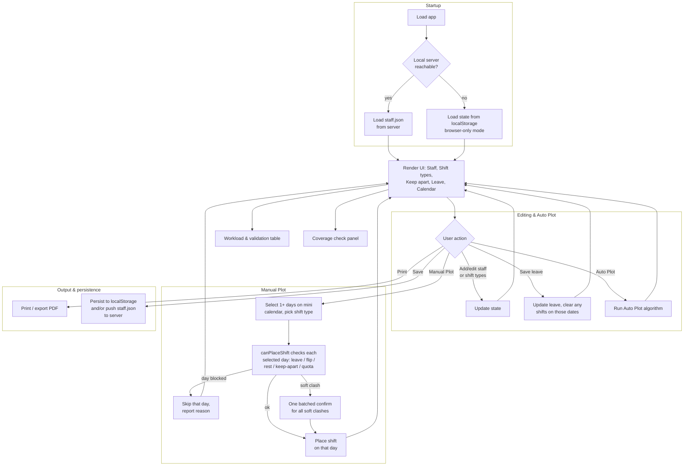
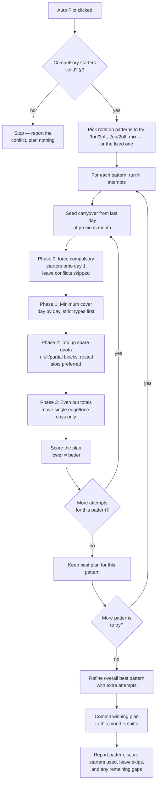

# Schedule Master

Schedule Master is a single-file HTML/JavaScript app for building and validating a monthly staff shift roster. It runs entirely in the browser — no build step, no backend required — and talks to a small local server (`ScheduleMaster.py`) for shared `staff.json` and `records.json` storage.

---

## How to run

1. Make sure Python 3 is installed: `python3 --version`.
2. Open a terminal *in the folder* containing `ScheduleMaster.py`, `ScheduleMaster.html`, and `staff.json` (they all need to sit together).
3. Make the server script executable — you only need to do this once:
   ```
   chmod +x ScheduleMaster.py
   ```
4. Run it:
   ```
   ./ScheduleMaster.py
   ```
5. A terminal message confirms the server is running and a browser tab opens automatically at `http://127.0.0.1:8743/ScheduleMaster.html` (or the next free port, if 8743 is taken). From here on, staff and saved records are read from and written directly to `staff.json` / `records.json` in that folder — the status line on load says *"Loaded N staff from staff.json (local server)"* to confirm it connected.
6. To stop the server, go back to the terminal and press `Ctrl+C`.

Next time, just repeat steps 4 and 5 — step 3 only needs doing once per copy of the files.

**Windows note:** `chmod`/`./` are Unix-only. On Windows, run `python ScheduleMaster.py` instead (or double-click the file if `.py` files are associated with Python) — everything else above is the same.

**Don't open `ScheduleMaster.html` directly** (double-clicking it, or dragging it into a browser) — a page only talks to the server if it was loaded *from* that server's address (`http://127.0.0.1:...`), not opened as a local `file://` page. Always start from the terminal as above.

---

## 1. What it does

- Holds a **staff list**, a set of **shift types** (e.g. Day / Night) with weekday/weekend headcount rules, optional **keep-apart pairs**, and per-person **leave**.
- Can **Auto Plot** an entire month automatically, respecting all the coverage and rest rules below — optionally forced to open the month with up to 4 named **compulsory starters** (see §9).
- Supports **Manual Plot** for one person across one or more days at a time, picked from a small click-to-select calendar, with the same rules enforced live.
- Shows a live **calendar**, a **workload & validation** table, and a **coverage check** panel.
- **Prints** a clean roster (and optionally the coverage check) to PDF/paper.
- Lets you **save a labeled snapshot** of the current month — staff, shift types, keep-apart pairs, leave, that month's shifts, and settings — as a standalone record you can look back on or delete later, kept separate from the live data (see §8).
- Persists everything to the browser's `localStorage`; staff can also be exported/imported as `staff.json`, or synced with a tiny local server if one is running.

---

## 2. Data model

Everything lives in a single in-memory state object, `S`, saved to `localStorage` on every change:

| Field | Meaning |
|---|---|
| `staff` | Array of staff names |
| `shiftTypes` | Array of `{id, name, start, end, wdTarget, wdMin, weTarget, flex, ka}` |
| `keepApart` | Pairs of names that should never share a shift |
| `leave` | `{ personName: ["YYYY-MM-DD", ...] }` |
| `shifts` | `{ "YYYY-MM-DD": { personName: shiftTypeId } }` |
| `expShifts`, `restHrs`, `rotation`, `requireAll`, `weekendLeaveNoQuota` | Global planning settings |

### Shift type fields
- **Weekday target** — headcount Auto Plot aims for on a weekday.
- **Weekday min** — the lowest it may sag to on a weekday, only if **Flex** is on.
- **Weekend target** — headcount on a weekend; weekends are always strict, so this doubles as the weekend minimum.
- **Flex** — allows the weekday dip described above.
- **Keep Apart** — a keep-apart pair is blocked from sharing this shift even on a weekday (normally keep-apart only applies strictly on weekends).

---

## 3. Rules the system enforces

1. **Minimum cover** — every shift type must meet its minimum headcount (weekday-min-if-flex, or target-if-not-flex; weekend target) every day.
2. **No 24-hour flip** — a person can't work a Day shift then a Night shift (or vice versa) on adjacent days; once on a shift type, they stay on it until their block ends.
3. **Minimum rest** — the gap between the end of one shift and the start of the next (for the same person) must be at least `restHrs` hours.
4. **Run length** — nobody works more than 3 consecutive calendar days on a shift type before a break (used both as a soft rotation pattern and a hard penalty).
5. **Keep-apart pairs** — never share a shift on a weekend, or on any shift flagged Keep Apart; sharing an ordinary weekday shift is allowed but flagged, and Manual Plot asks for confirmation.
6. **Quota** — each person's total shifts for the month should not exceed `expShifts` minus their leave days that month (weekend leave days are excluded from the deduction if "Weekend leave doesn't reduce expected shifts" is on).
7. **Shift-type variety** — if "Every person needs every shift type" is on, someone who worked at all that month should get at least one of each shift type, not just one.
8. **Leave blocks shifts** — a person on leave can never be placed that day; saving leave immediately clears any shift already on those dates.
9. **Weekend leave auto-fill** — if leave spans a weekend (leave either side of Saturday/Sunday), the weekend itself is automatically added as leave too.
10. **Compulsory starters** — up to 4 named people can be forced onto a chosen shift on day 1 of the month; Auto Plot seeds them in before minimum cover runs, so they count toward it automatically, then they're treated as ordinary people for the rest of the month (see §9).

---

## 4. The Auto Plot algorithm

Auto Plot's job: produce one full month's roster that satisfies the hard rules above and is as *fair* and *evenly rotated* as possible. It does this by **generating several candidate plans and scoring them**, rather than solving it as a single deterministic pass — the search space (who works what, when) is too large to solve exactly, so it uses a randomized construction + scoring + refinement approach (a form of stochastic local search).

### Step-by-step

1. **Pick rotation patterns to try.**
   - If rotation is "Auto": try `3 on/3 off`, `2 on/2 off`, and a `mix` of both (random per block).
   - If a pattern is fixed by the user, only that one is tried.

2. **Seed carryover from last month.** For every person, look at the last day of the *previous* month to see if they were mid-block or mid-rest, so a block that started in the last few days of last month correctly continues (or a rest period correctly continues) into this month.

3. **Build one candidate plan** (`buildOnePlan`), in four phases:
   - **Phase 0 — Compulsory starters.** Anyone set in §9 (and not on leave day 1) is force-placed on their chosen shift on day 1, then seeded a normal rotation-length block from there — the same mechanism used to continue a carried-over run. This runs before Phase 1, so they count toward day 1's minimum cover automatically.
   - **Phase 1 — Minimum cover.** Walk the month day by day. Strict (non-flex) shift types are filled before flexible ones. For each shift type each day:
     - First, let anyone already mid-block (including a Phase 0 compulsory starter) continue their run.
     - Then pick more people from those who are free, under quota, resting-eligible, and keep-apart-safe — preferring whoever has the most spare quota (with a small randomized tie-break, and a slight bias toward whichever shift type they've had less of so far) — until the day's minimum is met.
   - **Phase 2 — Top up spare quota.** For anyone still under their personal quota, try to place additional full rotation-length blocks (preferring a slot with a full rest gap on both sides, falling back to a 1-day gap only if nothing fully-rested exists), shrinking the block size if a person's remaining quota is smaller than one full block.
   - **Phase 3 — Even things out.** Repeatedly find whoever is most *over* their fair share and whoever has the most *room*, and move a single flexible-shift day between them — but only at the edge of a block or a lone day, never splitting a block in half, and only if it doesn't break rest, keep-apart, or run-length rules.

4. **Score the plan** (`scorePlan`) — lower is better. Heavy penalties for:
   - Any day/shift under its **minimum** (very large penalty — this should basically never happen if staffing is adequate).
   - Under **target** but above minimum (medium penalty).
   - Over target (small penalty, discourages needless over-staffing).
   - A hard keep-apart clash (weekend, or a Keep Apart–flagged shift).
   - A soft keep-apart clash on an ordinary weekday (smaller penalty).
   - A run longer than 3 consecutive days, or a shift-type flip between two consecutive worked days.
   - Missing a required shift type for someone who worked that month (if "every person needs every shift type" is on).
   - **Unevenness**: the spread (max − min) and variance of "quota left unused" across staff — this is weighted heavily so the optimizer actively favors an even spread of total shifts.
   - A secondary, smaller penalty for an uneven personal split between shift types (e.g. mostly Day vs mostly Night) — a tie-breaker under the total-quota fairness above.

5. **Repeat and pick the best.** For each rotation pattern, build several candidate plans (attempts) and keep the lowest-scoring one. Compare the best of each pattern, then run more attempts on the overall best pattern to refine it further.

6. **Commit.** The winning plan replaces the month's shifts. The status line reports the pattern used, its score, and how many minimum-coverage/keep-apart issues (if any) remain unresolved — a non-zero count means staffing is too tight to fully satisfy every rule.

### Manual Plot
Manual Plot places one person on one or more days at once. Pick a person, click days on the mini calendar to select them (days on leave are grayed out and can't be selected; days that already have a shift show it as a small colored tag), choose a shift type (or "Off" to clear), then apply.

Each selected day runs the same live checks Auto Plot's scoring penalizes for: leave conflicts, shift-type flip vs. the day before/after, minimum rest, keep-apart, and quota — so a manual placement never silently breaks a rule Auto Plot would have avoided:
- **Hard blocks** (leave, a shift-type flip, insufficient rest, a hard keep-apart clash, or being over quota) are skipped for that day and listed in the status message; every other selected day is still applied.
- **Soft keep-apart clashes** (sharing an ordinary weekday shift with a keep-apart partner) are batched into a single confirmation dialog covering all affected days, rather than one prompt per day.
- "Select all" selects every day in the month that isn't a leave day for the chosen person; "Clear selection" deselects everything. The selection is also cleared automatically after applying, or when you switch person, month, or year.

---

## 5. Flow diagram

### Overall app flow



### Auto Plot algorithm



---

## 6. Persistence & data flow

- **Browser-only mode**: everything (staff, shift types, leave, shifts, settings) is saved to `localStorage` under the key `planthat_state`. "Save" downloads `staff.json`; "Reload" re-imports a `staff.json` file.
- **Server mode**: if a local server responding at `api/staff` is found on load, staff are loaded from and saved back to it directly (`GET`/`PUT api/staff`), so multiple people can share the same `staff.json` on disk.
- **Reset all local data** wipes shifts, leave, staff and settings from *this browser only* — it does not touch `staff.json` on disk.

---

## 7. Printing

Print produces one calendar page per month plus an optional coverage-check page, using a landscape layout that auto-shrinks (via CSS `zoom`, which reflows layout so measurements stay accurate) to fit one page, and stretches rows to fill any leftover vertical space. A separate, more saturated color palette is swapped in for print so shift colors don't wash out on paper.

---

## 8. Saved records

The **Saved records** panel lets you keep a permanent, labeled history of past rosters — entirely separate from the live `S` state everything else in the app reads and writes. Saving, viewing, and deleting a record never changes what's currently plotted, and plotting or editing the live roster never changes a saved record.

- **Save**: typing a label (optional — it defaults to "Month Year") and clicking "Save current month as a record" takes a full snapshot of that month — staff, shift types, keep-apart pairs, leave, that month's shifts, and the global settings (expected shifts, min rest, rotation, and the two checkboxes) — and adds it to the saved list.
- **View**: each record shows a one-line summary (staff/shift-type/placed-shift counts) plus a "View" button that expands the complete saved snapshot as raw JSON, so you can always refer back to exactly what was saved.
- **Delete**: each record has its own "Delete" button (with a confirmation prompt); deleting one only removes that record.
- **Storage**: records live in their own file, `records.json`, kept apart from `staff.json`. In server mode they're read from and written to it directly (`GET`/`PUT api/records`); in browser-only mode they're kept in `localStorage` under `planthat_records`, with "Export records.json" / "Import records.json" buttons to move them to/from a file by hand, mirroring how staff are exported/imported.

---

## 9. Compulsory starters

The **Compulsory starters** panel lets you name up to 4 people who must already be working a chosen shift on **day 1** of the month, before Auto Plot runs — useful when you know a specific opening lineup is required regardless of what Auto Plot would otherwise pick.

- **Scope: one-off, not a standing rule.** The slots apply only to the month shown when you set them. Switching month or year (via the calendar's own selectors) clears all 4 slots back to empty — they do **not** carry forward to the next month automatically.
- **Setting it up**: each of the up to 4 slots is a person + a shift type. Leaving a slot's person or shift empty just means that slot isn't active yet.
- **Validation, live in the panel**:
  - The same person picked in two slots → blocked (duplicate), shown as a warning under the slots.
  - Two people who are a keep-apart pair, both set to start on the *same* shift → blocked, same as anywhere else a keep-apart clash would happen.
  - These two are hard errors: Auto Plot refuses to run at all until they're fixed, and the panel tells you exactly what to change.
- **Leave on day 1**: not a hard error. If a compulsory starter is on leave on the 1st, Auto Plot skips forcing that person for day 1 and places them normally instead (leave always blocks a placement, for anyone) — and says so afterwards in the status line, e.g. *"X was on leave on the 1st — placed normally instead of forced."*
- **How Auto Plot uses it**: this runs as a new **Phase 0**, before minimum cover (see §4) — each active compulsory starter is force-placed on their chosen shift on day 1, then seeded a normal rotation-length block from there, so they count toward day 1's minimum headcount automatically rather than needing a separate carve-out. After day 1, they're treated as an ordinary person: quota, rest, keep-apart, and the fairness balancing in Phase 3 all still apply to them normally.
- **Carryover overrides**: if forcing someone onto day 1 would normally have meant more rest, or continuing a different shift type from the end of last month, the compulsory-starter rule wins — they're placed as requested — but the status line notes the override, e.g. *"X was mid-block on Night — starting them on Day instead overrides that."*
